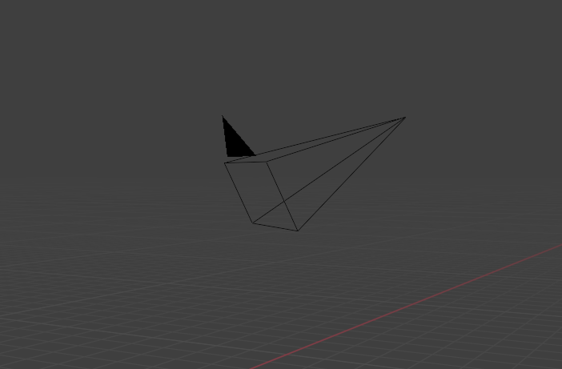
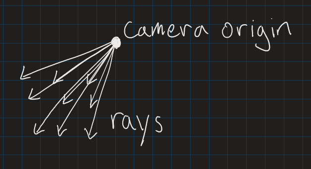
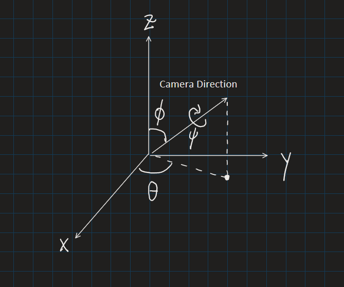

# Standard Perspective Projection of 3D objects

## Introduction
In 3D space, the primary way to display objects on a 2D screen is through **perspective**, where objects that are further from a **camera** appear smaller than objects that are closer. This model is useful, as it closely resembles the way that we perceive objects in real life.

<figure>
  
  <figcaption>Figure 1: The camera in Blender, a popular open-source 3D modeling software.</figcaption>
</figure>

One way to visualize this particular projection is to cast out a rectangular array of rays starting from the camera. Whenever a ray is blocked by an object, a pixel is drawn on the screen in the corresponding position. Each ray is thus responsible for a single pixel.

<figure>
  
  <figcaption>Figure 2: An array of rays cast from a single point.</figcaption>
</figure>

From this illustration, we can see that distant objects will in fact be depicted smaller, since the rays are more spread out, the further they are cast from the camera. We can thus quantify this shrinking effect: the height and width of a given "slice" of the array of rays increases linearly with the aligned distance, so the perceived size of objects in 3D space are generally inversely proportional to the distance from the camera.

## Points in 3D

The ray casting approach roughly matches the way that 3D perspective is implemented on computers, but it is also possible to find formulas for the projected position of 3D points on the 2D screen.

### Setup

Let's state some parameters and assumptions that we need to perform this transformation:

We need 3 angles that describe the rotation of the camera in 3D space, and 3 coordinates that describe the position of the camera origin. We also need the 3 coordinates describing the position of the point to be displayed on the 2D screen. Let's assume the 2D screen is an infinite plane, with the center at (0,0). To apply this to a real screen that is finite in size, simply restrict the view to a rectangular window. We can also assume that if a line segment of unit length that is orthogonal to the direction of the camera is 1 unit away from the camera, then, it should be 1 unit long when projected onto the screen.

Here are the angles with a diagram underneath:

$\theta$ : The azimathal angle, or the angle of the direction of the camera projected in the XY plane.

$\phi$ : The polar angle, or the angle from the Z axis.

$\psi$: The roll, or the angle around the direction the camera is facing. This angle is not as important as the other 2, as it corresponds with rotating the 2D screen by some angle.

<figure>
  
  <figcaption>Figure 3: The 3 angles that specify the rotation of the camera.</figcaption>
</figure>

These angles might be familiar to those that understand pitch, yaw, and roll. In fact, $\theta$, $\phi$, and $\psi$ act around the exact same axes, respectively.

We will denote the position of the camera as the 3D vector $C$, and the position of the point as $P$. We will also denote the transformed position of the point as the 2D vector $Q$.

### Transformation

If we can find the transformed position of the point when the camera is at the origin, and pointing in a particular direction, then we can find the transformed position of the point for every configuration of the camera, as we can simply transform the position of the point  in the general case to match the special case.

Thus, the first step in finding the projected position of the point is finding the relative position of the point. To do this, we simply subtract the position of the camera from the position of the point, resulting in $P - C$.

The second step is to handle the rotation of the camera by rotating the position of the point accordingly. If all of $\theta$, $\phi$, and $\psi$ are 0, then, the camera faces in the positive Z direction (which matches some conventions, but differs from some notable implementations like OpenGL). To transform the point (with the relative position $P - C$) to match this particular configuration, we can rotate the point in the opposite direction of the orientation of the camera by first rotating the point by $-\theta$ around the Z-axis and then $-\phi$ around the Y-axis (this works because the camera's rotation can be applied in the order $\phi$ around the Y-axis, then $\theta$ around the Z-axis, so we are simply inverting these rotations). For simplicity, we can disregard $\psi$ in this step, as it can be handled by rotating $Q$.

To perform a rotation by $-\theta$ around the Z-axis, we can multiply the position vector by the following matrix:

$$
\begin{bmatrix}
\cos{(-\theta)} & -\sin{(-\theta)} & 0 \\
\sin{(-\theta)} & \cos{(-\theta)} & 0 \\
0 & 0 & 1
\end{bmatrix}
$$

This matrix can be derived by recalling that a linear transformation can be described by the positions of the basis vectors after the transformation. We need only rotate the basis vectors corresponding to the X and Y axis by $-\theta$ around the Z-axis to find the rotation of any vector around the Z-axis.

Similarly, a rotation by $-\phi$ around the Y-axis can be represented by the following matrix:

$$
\begin{bmatrix}
\cos{(-\phi)} & 0 & \sin{(-\phi)} \\
0 & 1 & 0 \\
-\sin{(-\phi)} & 0 & \cos{(-\phi)}
\end{bmatrix}
$$

Simplifying, we get the following combined transformation:
$$
\begin{aligned}
T(P, C, \theta, \phi)

&=
\begin{bmatrix}
\cos{(-\phi)} & 0 & \sin{(-\phi)} \\
0 & 1 & 0 \\
-\sin{(-\phi)} & 0 & \cos{(-\phi)}
\end{bmatrix}
\begin{bmatrix}
\cos{(-\theta)} & -\sin{(-\theta)} & 0 \\
\sin{(-\theta)} & \cos{(-\theta)} & 0 \\
0 & 0 & 1
\end{bmatrix}
(P-C)

\\

&=
\begin{bmatrix}
\cos{(\phi)} & 0 & -\sin{(\phi)} \\
0 & 1 & 0 \\
\sin{(\phi)} & 0 & \cos{(\phi)}
\end{bmatrix}
\begin{bmatrix}
\cos{(\theta)} & \sin{(\theta)} & 0 \\
-\sin{(\theta)} & \cos{(\theta)} & 0 \\
0 & 0 & 1
\end{bmatrix}
(P-C)

\\

&=
\begin{bmatrix}
\cos{(\phi)} \cos{(\theta)} & \cos{(\phi)} \sin{(\theta)} & -\sin{(\phi)} \\
-\sin{(\theta)} & \cos{(\theta)} & 0 \\
\sin{(\phi)} \cos{(\theta)} & \sin{(\phi)} \sin{(\theta)} & \cos{(\phi)}
\end{bmatrix}
(P-C)
\end{aligned}
$$

Let's define the point transformed to be relative to the camera $P'$:

$$

P'= T(P, C, \theta, \phi) = 

\begin{bmatrix}
\cos{(\phi)} \cos{(\theta)} & \cos{(\phi)} \sin{(\theta)} & -\sin{(\phi)} \\
-\sin{(\theta)} & \cos{(\theta)} & 0 \\
\sin{(\phi)} \cos{(\theta)} & \sin{(\phi)} \sin{(\theta)} & \cos{(\phi)}
\end{bmatrix}
(P-C)

$$

Now, the Z-component of $P'$ represents the aligned distance from the camera. In other words, if $M$ is a plane that is orthogonal to the orientation of the camera (in the default orientation with all angles set to 0), and $M$ contains $P'$, then the distance between $M$ and the origin is the Z-component of $P'$. We can use this to implement the shrinking effect as objects get further by using a factor of $\frac{1}{P'_Z}$ in our fully transformed point, $Q$. Therefore, a possible formula for $Q$ is:

$$
Q = f(P') = \langle \frac{-P'_X}{P'_Z}, \frac{P'_Y}{P'_Z} \rangle
$$

(The factor of -1 in the X-component is so that a with a higher X-value than the camera will have a lower X-value on the 2D screen, which means that it will be depicted toward the left, which would preserve the right hand rule between the X, Y, and Z axes.)

## Projecting Curves

Now that we have a formula for projecting points, we can project all curves that are parametrized in 3D.

### Lines

Lines in 3D are parametrized by:

$$
\vec{r}(t) = \vec{d}t + \vec{p_0}
$$

where $\vec{d}$ is a vector specifying the orientation of the line, and $\vec{p_0}$ is a point on the line.

If we plug this into our perspective projection (without loss of generality disregarding the rotation of the camera), we get:

$$
\begin{aligned}
\vec{r}_{transformed}(t)

=
\langle \frac{-\vec{d}_x t - \vec{p_0}_x}{\vec{d}_z t}, \frac{\vec{d}_y t + \vec{p_0}_y}{\vec{d}_z t} \rangle

\\

=
\frac{1}{\vec{d}_z t}
\langle -\vec{d}_x t - \vec{p_0}_x, \vec{d}_y t + \vec{p_0}_y \rangle

\end{aligned}
$$

which also parametrizes a line in 2D space (that has a singularity at $t=0$).

This means that lines in 3D space always remain straight when projected onto a 2D screen.

### Circles

Circles are parametrized by:
